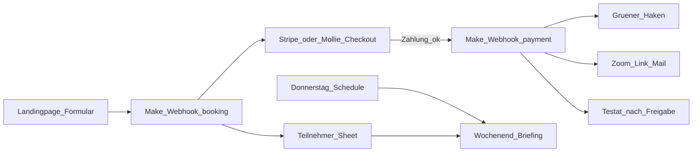

# Automatisierung: Vercel + Make.com (ohne eigenen Server)

Schlanke Architektur: statische Landingpage auf Vercel, Logik in Make.com (oder Zapier).



## Umgebungsvariablen

| Variable | Wo | Zweck |
| --- | --- | --- |
| `BOOKING_WEBHOOK_URL` | Vercel (Server) | Make Custom Webhook – Szenario A |
| `VITE_CONTACT_EMAIL` | Build | Mailto-Fallback |
| `VITE_FORCE_MAILTO=true` | lokal | Formular nur per Mail testen |

Die Landingpage POSTet auf **`/api/booking`** (Vercel Function). Die Function leitet an Make weiter – ohne CORS-Probleme und ohne aufgeblähten App-Server.

Payload-Beispiel:

```json
{
  "event": "booking.created",
  "status": "pending_payment",
  "product": "nis2-cra-executive-workshop",
  "priceNetEur": 1000,
  "currency": "EUR",
  "company": "Muster GmbH",
  "gfName": "Max Mustermann",
  "email": "max@muster.de",
  "paymentMethod": "Kreditkarte",
  "createdAt": "2026-07-22T12:00:00.000Z"
}
```

Make kann mit Modul **Webhook – Response** antworten:

```json
{ "checkoutUrl": "https://checkout.stripe.com/..." }
```

Dann leitet die Seite den GF sofort zum Checkout weiter.

## Szenario A – Anmeldung / Lead (Trigger)

1. **Custom Webhook** empfängt Events:
   - `booking.created` → Sheet Status `pending_payment`, Checkout/Rechnung starten
   - `lead.created` → Sheet Status `new_lead`, Follow-up mit Termindetails (kein Zoom, kein Testat)
2. Sheet-Felder: Firma, Name, E-Mail, ggf. Rechnungsadresse/Zahlungsart, `createdAt`, Event-Typ
3. **Bei Booking – Zahlung starten**
   - Sofortmethoden: Stripe/Mollie → `checkoutUrl` zurückgeben oder Link per Mail
   - Klassische Rechnung: PDF rausschicken; Status bleibt `pending_payment`
4. Bestätigungsmail (Booking): „Zugang und Testat erst nach Zahlungseingang (spätestens 1 Woche vor Termin).“
5. Lead-Mail: nur Termininfos / §-38-Kurzüberblick – kein Checkout-Zwang

## Szenario B – Digitaler Wächter (Zahlungseingang)

1. Trigger: Stripe `checkout.session.completed` / `invoice.paid` **oder** Mollie `payment.paid`
2. Teilnehmer in Sheet suchen (E-Mail / Session-Metadaten)
3. Setzen:
   - Status: `paid`
   - Grüner Haken: `true`
   - `paidAt`: Timestamp
4. Zoom-Link-Mail freischalten (Template mit Termin Sa 09:00–12:00)
5. Testat: **noch nicht** automatisch final – erst nach Workshop + manueller/regelbasierter Freigabe (Szenario C)

## Szenario C – Testat nach Freigabe

1. Nach dem Workshop: Status `attended` setzen (manuell in Sheet oder Checkbox in Make)
2. Erst dann: PDF-Testat generieren (z. B. PDFMonkey / DocsAutomator / Google Docs Vorlage) mit Name, Firma, Datum, Bezug § 38 BSIG / CRA
3. Mail mit Testat an Teilnehmer
4. Corporate-authoritativ – **kein** Behörden-/BSI-Siegel

## Szenario D – Wochenend-Briefing (Chef-Report)

**Schedule:** jeden Donnerstag 18:00 oder Freitag 07:30.

Filter aus dem Sheet für den nächsten Samstagstermin:

**Ready (grüner Haken / bezahlt)**

```
Wochenend-Briefing NIS-2-Schulung:
Angemeldet & Bezahlt (Grüner Haken / Ready): X Teilnehmer (Firma …). Kohle ist da.
```

**Ausstehend**

```
Ausstehend (Zahlung noch nicht eingegangen): Y Teilnehmer (Firma …).
Hinweis: Automatische Zahlungserinnerung ist raus.
Wenn bis Freitag 18:00 Uhr kein Geldeingang → automatisch auf den nächsten Monat verschoben.
```

Kanäle: E-Mail an dich und/oder Telegram/WhatsApp Business / SMS.

### Freitag 18:00 – Auto-Verschiebung

Zweites Schedule-Szenario:

1. Alle `pending_payment` für diesen Samstag finden
2. Termin auf nächsten Monat verschieben
3. Teilnehmer informieren
4. Reminder-Flag setzen

## Was du nicht brauchst

- Keinen eigenen App-Server
- Keine manuelle Excel-Pflege
- Keine Zoom-Links vor Geldeingang

Du bekommst nur die Ready-Liste – die Leute, die am Samstag tatsächlich dabei sind und bezahlt haben.
