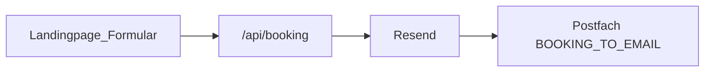

# Anmeldungen: Vercel + Resend → Postfach

Schlanke Architektur: Landingpage auf Vercel, Buchungen per E-Mail ins Postfach (kein Make nötig).

## Umgebungsvariablen (Vercel)

| Variable | Pflicht | Zweck |
| --- | --- | --- |
| `RESEND_API_KEY` | nein* | API-Key von [resend.com](https://resend.com) — empfohlen |
| `BOOKING_TO_EMAIL` | nein | Empfänger (Default: `info@hampacorequality.de`) |
| `BOOKING_FROM_EMAIL` | nein | Absender bei Resend |
| `VITE_CONTACT_EMAIL` | nein | Mailto-Fallback |
| `VITE_FORCE_MAILTO=true` | nein | Lokal: nur Mailto |

\*Ohne `RESEND_API_KEY` antwortet die API mit `clientFallback: true`. Der Browser sendet dann per **FormSubmit** an `BOOKING_TO_EMAIL` (inkl. Autoresponse an den Anmelder). Beim allerersten Mal ggf. Aktivierungslink in der Mail an `info@hampacorequality.de` bestätigen.

### Vercel einrichten

1. Account auf https://resend.com → **API Key** erzeugen
2. Vercel Project → **Settings → Environment Variables**:
   - `RESEND_API_KEY` = `re_…`
   - `BOOKING_TO_EMAIL` = deine Zieladresse (optional)
3. Redeploy (damit die Function die Env sieht)
4. Testbuchung auf der Live-Seite → Mail im Postfach prüfen

> Mit dem Default-Absender `onboarding@resend.dev` liefert Resend oft nur an die **Account-E-Mail** bei Resend. Für Zustellung an `info@…` Domain in Resend verifizieren und `BOOKING_FROM_EMAIL` setzen.

## Payload

Die Landingpage POSTet JSON auf **`/api/booking`**. Die Function sendet:

1. **interne Mail** an `BOOKING_TO_EMAIL` (dein Postfach)
2. **Bestätigungsmail** an die E-Mail-Adresse des Anmelders (Buchung oder Lead)

Antwort bei Erfolg: `{ "ok": true, "id": "…", "confirmationId": "…" }`.

Lokal (`npm run dev`) gibt es keine Vercel-Function — dann Mailto-Fallback an `VITE_CONTACT_EMAIL`.

## Später optional (Zahlung / Testat)

Checkout, Google-Meet-Freigabe und Testat können später wieder per Make/Sheet ergänzt werden. Der aktuelle Go-Live-Pfad ist: **Formular → E-Mail ins Postfach**.
