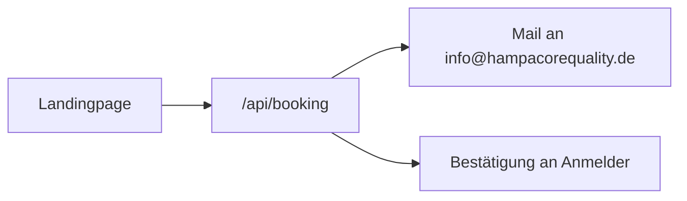

# Robuster E-Mail-Versand (Resend)

Anmeldung und Bestätigung laufen **nur über Resend** — kein FormSubmit, kein Mailto.

## Pflicht-Setup (einmalig, ca. 3 Minuten)

### 1. Resend-Account

1. Öffne https://resend.com und registriere dich (kostenlos)
2. **API Keys** → Create → Key kopieren (`re_…`)

### 2. Vercel Environment Variable

1. https://vercel.com → Projekt der Landingpage
2. **Settings → Environment Variables**
3. Anlegen:

| Name | Wert | Environments |
| --- | --- | --- |
| `RESEND_API_KEY` | `re_…` | Production, Preview |
| `BOOKING_TO_EMAIL` | `info@hampacorequality.de` | Production, Preview (optional) |
| `BOOKING_FROM_EMAIL` | zuerst: `HCQ Zertifikatsschulung <onboarding@resend.dev>` | Production, Preview (optional) |

4. **Deployments → Redeploy** (ohne Cache)

### 3. Test

Buchung mit einer echten E-Mail absenden:

- HCQ erhält die Anmeldung
- Anmelder erhält die Bestätigung (auch Spam prüfen)

## Domain (für Produktion empfohlen)

Mit `onboarding@resend.dev` kann Resend anfangs eingeschränkt zustellen.

Für zuverlässige Kunden-Mails:

1. In Resend eine Domain verifizieren (z. B. `hampacorequality.de`)
2. `BOOKING_FROM_EMAIL` setzen auf z. B.  
   `HCQ Zertifikatsschulung <anmeldung@hampacorequality.de>`
3. Redeploy

## Fehlercodes der API

| Code | Bedeutung |
| --- | --- |
| `RESEND_NOT_CONFIGURED` | `RESEND_API_KEY` fehlt |
| `OWNER_MAIL_FAILED` | Mail an HCQ fehlgeschlagen |
| `CONFIRM_MAIL_FAILED` | Bestätigung an Anmelder fehlgeschlagen |

Ohne Key schlägt die Buchung bewusst fehl (keine Schein-Erfolge).
